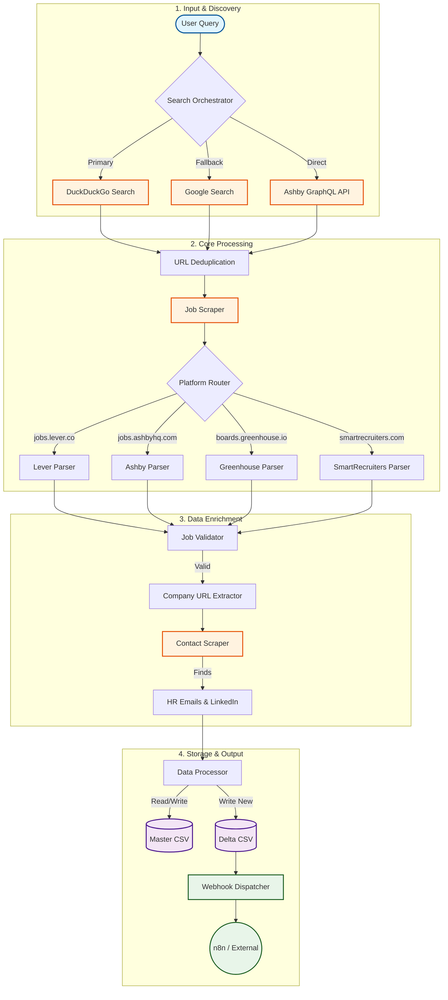

<div align="center">

# 🎯 Job Search Scraper
### Automated Job Discovery & Enrichment Engine

[](https://www.python.org/)
[]()
[]()

**Discover, filter, and enrich job postings from Lever, Ashby, Greenhouse & SmartRecruiters.**

[Features](#-key-features) • [Architecture](#-system-architecture) • [Quick Start](#-quick-start) • [Configuration](#-configuration)

</div>

---

## 📋 Overview

This intelligent scraper automates the hunt for engineering roles (focused on AI/ML by default) across major applicant tracking systems (ATS). Unlike simple scrapers, it:
1.  **Discovers** job listings via search engines (DuckDuckGo/Google) and direct APIs.
2.  **Validates** listings to ensure they are active and relevant.
3.  **Enriches** job data by finding company websites, HR emails, and LinkedIn profiles.
4.  **Integrates** with workflow tools like n8n via webhooks.

## 🌟 Key Features

*   **🔍 Hybrid Discovery**: Combines broad search engine queries (DuckDuckGo + Google fallback) with targeted API calls (Ashby GraphQL).
*   **🏢 Multi-Platform Support**: Specialized parsers for **Lever**, **Ashby**, and **SmartRecruiters**.
*   **🧠 Smart Enrichment**: Automatically locates company websites and attempts to scrape HR contact details (emails & LinkedIn profiles).
*   **💾 Differential Storage**: Maintains a master database (`master_jobs.csv`) and generates a delta file (`delta_jobs.csv`) for new findings only.
*   **🔄 Workflow Ready**: Pushes new jobs to a webhook URL (e.g., n8n, Zapier) for instant notifications or processing.

---

## 🏗️ System Architecture

The system follows a modular pipeline architecture, separating discovery, parsing, enrichment, and storage.



### Data Flow

1.  **Search**: The script generates site-specific queries (`site:jobs.lever.co "AI Engineer"`) and executes them in parallel.
2.  **Direct API**: For known high-value companies (defined in config), it queries the Ashby GraphQL API directly, bypassing search engine lag.
3.  **Parsing**: HTML is fetched and routed to the correct parser (Lever, Ashby, etc.) to extract standardized fields (Title, Location, Description).
4.  **Enrichment**:
    *   Finds the main company website (checking metadata, links, or performing a Google search).
    *   Scans the company website (Careers, Team, About pages) for email addresses and LinkedIn URLs.
5.  **Output**: New unique jobs are appended to the master list and sent to the configured webhook.

---

## 🚀 Quick Start

### Prerequisites
*   Python 3.8+
*   `pip` (Python package manager)

### Installation

1.  **Clone the repository**
    ```bash
    git clone https://github.com/yourusername/job-search-scraper.git
    cd job-search-scraper
    ```

2.  **Set up virtual environment**
    ```bash
    python -m venv venv
    source venv/bin/activate  # On Windows: venv\Scripts\activate
    ```

3.  **Install dependencies**
    ```bash
    pip install -r job_scraper/requirements.txt
    ```

### Usage

**Basic Run (Default AI/ML Search):**
```bash
python job_scraper/scraper.py
```

**Custom Search Query:**
```bash
python job_scraper/scraper.py "Founding Engineer"
python job_scraper/scraper.py "Frontend React Remote"
```

---

## ⚙️ Configuration

Key settings can be modified directly in `job_scraper/scraper.py`:

| Constant | Description | Default |
|----------|-------------|---------|
| `MAX_RESULTS` | Number of results to fetch per search engine query. | `20` |
| `WEBHOOK_URL` | URL to POST new jobs to (e.g., n8n). | `localhost:5678/...` |
| `ASHBY_COMPANIES` | List of company slugs to check via direct API. | `['pear', 'deel', ...]` |
| `MASTER_CSV` | Filename for persistent job history. | `master_jobs.csv` |

### Adding New Companies (Ashby API)
Add the company's Ashby slug to the `ASHBY_COMPANIES` list in `scraper.py`:
```python
ASHBY_COMPANIES = [
    "pear", "deel", "cursor", "your-target-company"
]
```

---

## 📁 Project Structure

```text
job_search/
├── job_scraper/
│   ├── scraper.py          # Main application logic
│   ├── requirements.txt    # Project dependencies
│   └── debug_google.py     # Utility to test Google Search connectivity
├── master_jobs.csv         # Database of all scraped jobs
├── delta_jobs.csv          # Jobs found in the most recent run
└── README.md               # Documentation
```

## 📊 Output Format

The scraper produces CSV files with the following schema:

| Column | Description |
|--------|-------------|
| `Job Title` | Standardized job title |
| `Company` | Company name extracted from URL |
| `Location` | Job location (Remote/City) |
| `Job URL` | Direct link to the application |
| `Company Website` | Detected main website |
| `HR Contact Email` | Discovered email (if any) |
| `HR LinkedIn` | Discovered LinkedIn profile (if any) |
| `Source` | ATS Platform (Lever, Ashby, etc.) |

---

## 🔧 Troubleshooting

*   **No results found?**
    *   Search engines might be rate-limiting you. The script has built-in delays, but try increasing `time.sleep()` if issues persist.
    *   Check if the `ASHBY_COMPANIES` list needs updating with valid company slugs.
*   **Webhook failures?**
    *   Ensure your local n8n instance or webhook receiver is running.
    *   Verify the `WEBHOOK_URL` in `scraper.py`.
*   **"Closed" jobs appearing?**
    *   The scraper attempts to detect closed jobs via text analysis ("no longer open") and redirect checking, but some edge cases may slip through.

---

<div align="center">
    <i>Built for efficient job hunting.</i>
</div>

